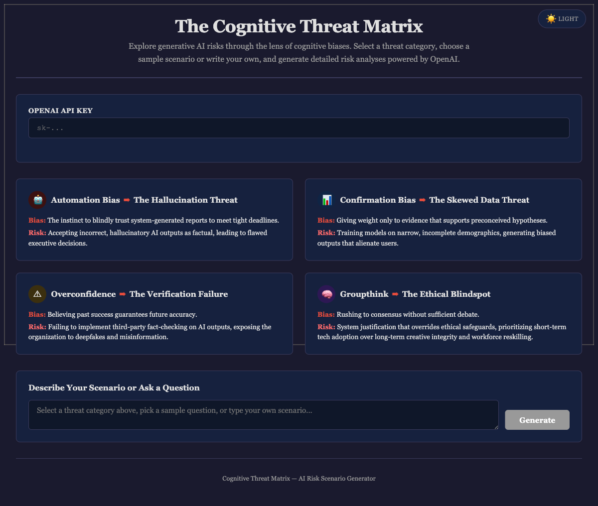

<div align="center">

# The Cognitive Threat Matrix

[](https://developer.mozilla.org/en-US/docs/Web/HTML)
[](https://developer.mozilla.org/en-US/docs/Web/CSS)
[](https://developer.mozilla.org/en-US/docs/Web/JavaScript)
[](https://openai.com)
[](https://alfredang.github.io/genaiethics/)
[](https://opensource.org/licenses/MIT)

**Explore generative AI risks through the lens of cognitive biases. Generate detailed risk scenarios powered by OpenAI.**

[Live Demo](https://alfredang.github.io/genaiethics/) · [Report Bug](https://github.com/alfredang/genaiethics/issues) · [Request Feature](https://github.com/alfredang/genaiethics/issues)

</div>

## Screenshot



## About

The Cognitive Threat Matrix is an interactive web tool that maps cognitive biases to generative AI risks, helping organizations identify and mitigate threats before they escalate. Users can explore four threat categories, select from 20 pre-built scenarios, or write custom prompts to generate detailed AI-powered risk analyses.

### Key Features

- **Four Threat Categories** — Hallucination, Skewed Data, Verification Failure, and Ethical Blindspot
- **20 Sample Scenarios** — Pre-built questions across all threat categories for quick exploration
- **AI-Powered Analysis** — Generates structured risk reports using OpenAI GPT-4o-mini
- **Dark/Light Theme** — Toggle between dark and light modes with persistent preference
- **Zero Dependencies** — Single HTML file with no build tools or frameworks required
- **Responsive Design** — Works on desktop and mobile devices

## Tech Stack

| Category | Technology |
|----------|-----------|
| Frontend | HTML5, CSS3, Vanilla JavaScript |
| AI/LLM | OpenAI GPT-4o-mini |
| Styling | CSS Custom Properties (Dark/Light theming) |
| Deployment | GitHub Pages + GitHub Actions |

## Architecture

```
┌─────────────────────────────────────────────┐
│                  Browser                     │
│                                             │
│  ┌──────────┐  ┌──────────┐  ┌───────────┐ │
│  │  Theme   │  │  Threat  │  │  Sample   │ │
│  │  Toggle  │  │  Matrix  │  │  Questions│ │
│  └──────────┘  └──────────┘  └───────────┘ │
│                                             │
│  ┌──────────────────────────────────────┐   │
│  │         Prompt Input Area            │   │
│  └──────────────┬───────────────────────┘   │
│                 │                            │
│                 ▼                            │
│  ┌──────────────────────────────────────┐   │
│  │       OpenAI API (fetch)             │───┼──► api.openai.com
│  └──────────────┬───────────────────────┘   │
│                 │                            │
│                 ▼                            │
│  ┌──────────────────────────────────────┐   │
│  │     Formatted Risk Analysis Output   │   │
│  └──────────────────────────────────────┘   │
└─────────────────────────────────────────────┘
```

## Project Structure

```
genaiethics/
├── index.html                          # Main application (HTML + CSS + JS)
├── screenshot.png                      # Auto-captured site screenshot
├── README.md                           # Project documentation
└── .github/
    └── workflows/
        └── deploy-pages.yml            # GitHub Pages deployment workflow
```

## Getting Started

### Prerequisites

- A modern web browser (Chrome, Firefox, Safari, Edge)
- An [OpenAI API key](https://platform.openai.com/api-keys)

### Run Locally

1. **Clone the repository**
   ```bash
   git clone https://github.com/alfredang/genaiethics.git
   cd genaiethics
   ```

2. **Open in browser**
   ```bash
   open index.html
   ```
   Or simply double-click `index.html` in your file manager.

3. **Enter your OpenAI API key** and start exploring AI risk scenarios.

### Usage

1. Enter your OpenAI API key in the input field
2. Click one of the four threat category cards
3. Select a sample scenario or type your own question
4. Click **Generate** to receive a structured risk analysis
5. Toggle dark/light theme using the button in the top-right corner

## Deployment

This project is deployed automatically to GitHub Pages via GitHub Actions. Every push to `main` triggers a new deployment.

To deploy your own instance:
1. Fork this repository
2. Enable GitHub Pages in your repo settings (Source: GitHub Actions)
3. Push to `main` — the workflow handles the rest

## The Cognitive Threat Matrix Framework

| Cognitive Bias | AI Threat | Description |
|---------------|-----------|-------------|
| **Automation Bias** | The Hallucination Threat | Blindly trusting AI outputs, accepting fabricated information as factual |
| **Confirmation Bias** | The Skewed Data Threat | Training models on narrow data that reinforces preconceived hypotheses |
| **Overconfidence** | The Verification Failure | Assuming past AI accuracy guarantees future correctness |
| **Groupthink** | The Ethical Blindspot | Rushing AI adoption without sufficient debate or ethical review |

## Contributing

1. Fork the repository
2. Create your feature branch (`git checkout -b feature/amazing-feature`)
3. Commit your changes (`git commit -m 'Add amazing feature'`)
4. Push to the branch (`git push origin feature/amazing-feature`)
5. Open a Pull Request

Join the discussion in [Issues](https://github.com/alfredang/genaiethics/issues).

---

<div align="center">

### Developed by Tertiary Infotech Academy Pte. Ltd.

**Acknowledgements:** OpenAI for GPT-4o-mini API, GitHub Pages for hosting

If you found this useful, please give it a ⭐

</div>
